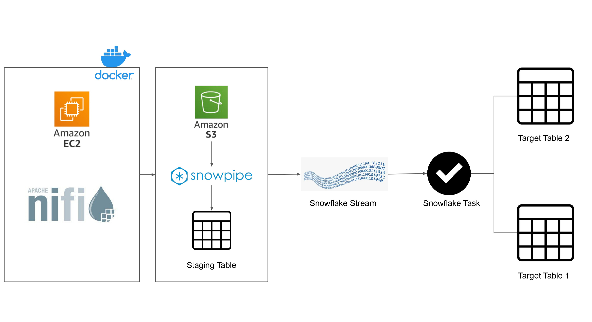

# Real-time Data Pipeline with Snowflake for SCD Type 1 & Type 2 Implementation

This project demonstrates an end-to-end data pipeline that captures and processes data changes in real-time using Slowly Changing Dimensions (SCD) Type 1 and Type 2 methodologies. The pipeline leverages Docker for containerizing services like Apache NiFi and JupyterLab, AWS for cloud infrastructure, and Snowflake for its powerful data warehousing and processing capabilities, including Streams and Tasks.

---

## 📜 Overview

The core of this project is to showcase how to handle data changes over time. It uses synthetic customer data generated by a Python script in a Jupyter Notebook. This data is then moved by NiFi to an AWS S3 bucket, from where it's automatically ingested into Snowflake using Snowpipe. Snowflake tasks are then scheduled to process this raw data and apply SCD Type 1 and Type 2 logic to update a master customer table and maintain a history of changes.

### Architecture Diagram


---

## ✨ Features

* **SCD Type 1:** Overwrites existing records with new data.
* **SCD Type 2:** Preserves the history of data changes by creating new records.
* **Real-time Ingestion:** Uses Snowflake's Snowpipe to automatically load new data from S3.
* **Automation:** Employs Snowflake Tasks to schedule and automate the SCD processing logic.
* **Containerized Environment:** Uses Docker and Docker Compose to easily set up the necessary services.

---

## 🛠️ Tech Stack

* **Cloud Provider:** AWS (for EC2 and S3)
* **Data Warehouse:** Snowflake
* **Data Integration:** Apache NiFi
* **Data Generation:** Python with Faker library in JupyterLab
* **Orchestration:** Docker

---

## ⚙️ Setup and Installation

### 1. AWS EC2 and Security

* Launch an **EC2 instance**, preferably a `t2.xlarge` with at least **32GB of storage**.
* Configure the security group to allow inbound traffic on ports **4000-38888** to access the services.
* Connect to your EC2 instance via SSH:
    ```bash
    ssh -i your-key.pem ec2-user@your-ec2-public-ip
    ```

### 2. Docker Environment

* Install Docker and Docker Compose on the EC2 instance.
    ```bash
    sudo yum update -y
    sudo yum install docker
    sudo curl -L "[https://github.com/docker/compose/releases/download/1.29.1/docker-compose-$(uname](https://github.com/docker/compose/releases/download/1.29.1/docker-compose-$(uname) -s)-$(uname -m)" -o /usr/local/bin/docker-compose
    sudo chmod +x /usr/local/bin/docker-compose
    sudo systemctl start docker
    ```
* Copy your project files (including the `docker-compose.yml`) to the EC2 instance.
* Start the services using Docker Compose:
    ```bash
    docker-compose up -d
    ```

### 3. Snowflake Setup

* Execute the SQL scripts in the following order:
    1.  **`1. Table Creation.sql`**: This script sets up the database, schema, and all the necessary tables (`customer`, `customer_history`, `customer_raw`) and a stream object (`customer_table_changes`).
    2.  **`2. Data Loading.sql`**: This script creates the external stage pointing to your S3 bucket and the Snowpipe (`customer_s3_pipe`) for automatic data ingestion. **Remember to update the S3 path and your AWS credentials**.
    3.  **`3. SCD 1.sql`**: This script contains the `MERGE` statement for SCD Type 1 logic and creates a stored procedure (`pdr_scd_demo`) and a task (`tsk_scd_raw`) to automate it.
    4.  **`4. SCD 2.sql`**: This script creates a view (`v_customer_change_data`) to handle the change data logic and a task (`tsk_scd_hist`) to apply SCD Type 2 changes to the `customer_history` table.

---

## 🚀 Running the Pipeline

### 1. Generate Fake Data

* Access JupyterLab at `http://<your-ec2-ip>:4888/lab`.
* Open the `faker.ipynb` notebook and run the cells to generate a CSV file with synthetic customer data. The file will be saved in the `/opt/workspace/nifi/FakeDataset/` directory inside the `nifi` container.

### 2. Data Ingestion (NiFi & Snowpipe)

* Access Apache NiFi at `http://<your-ec2-ip>:2080/nifi/`.
* You will need to design a NiFi flow that picks up the generated CSV file and uploads it to the S3 bucket that you configured in `2. Data Loading.sql`.
* Once the file is in S3, the `customer_s3_pipe` Snowpipe will automatically ingest the data into the `customer_raw` table in Snowflake.

### 3. Automated SCD Processing

* The Snowflake tasks (`tsk_scd_raw` and `tsk_scd_hist`) will run on their defined schedules (every 1 minute in the provided code).
* `tsk_scd_raw` will execute the SCD Type 1 logic, merging data from `customer_raw` into the main `customer` table.
* The changes made to the `customer` table are captured by the `customer_table_changes` stream.
* `tsk_scd_hist` will then use the data from the stream to perform the SCD Type 2 logic, updating the `customer_history` table to maintain a full history of changes.

### 4. Monitoring

* You can check the status of the Snowflake tasks and their next scheduled run times using the queries provided in the SQL scripts.
* Query the `customer` and `customer_history` tables to see the results of the SCD processing.
